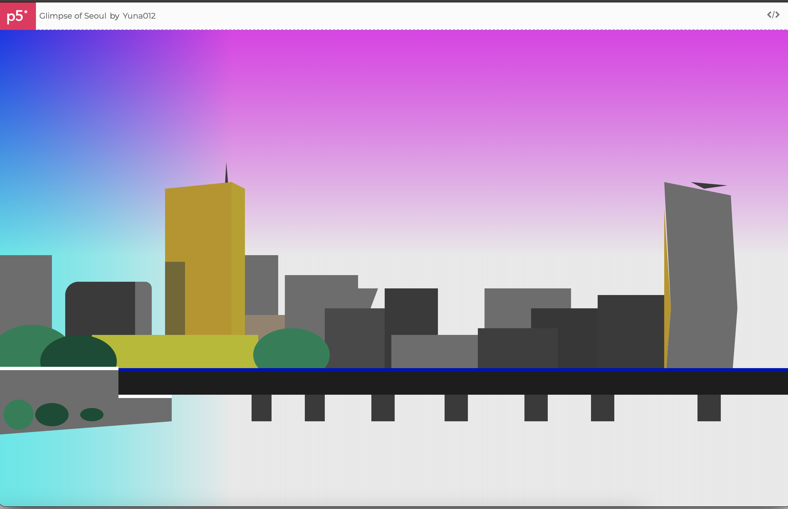
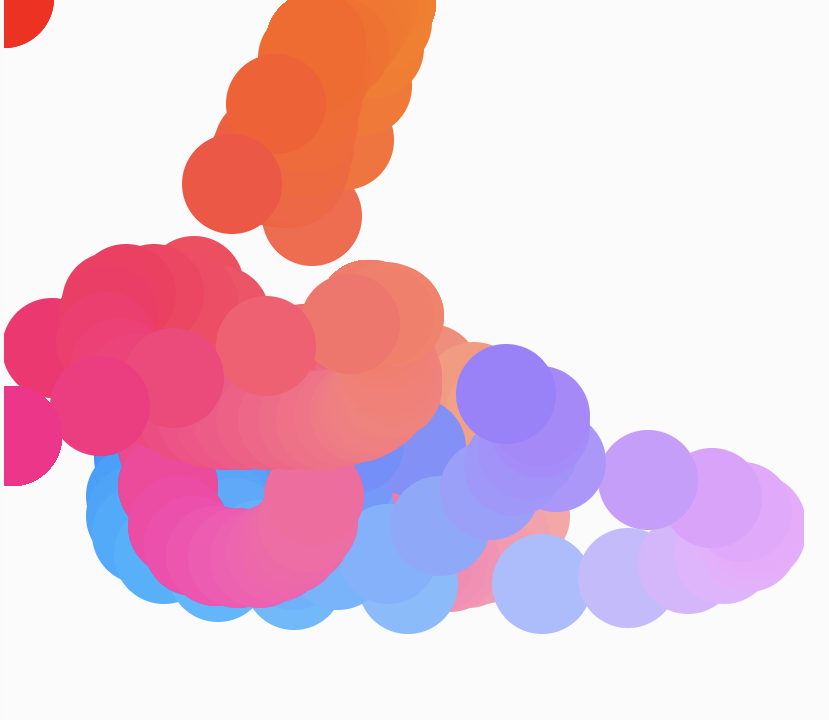
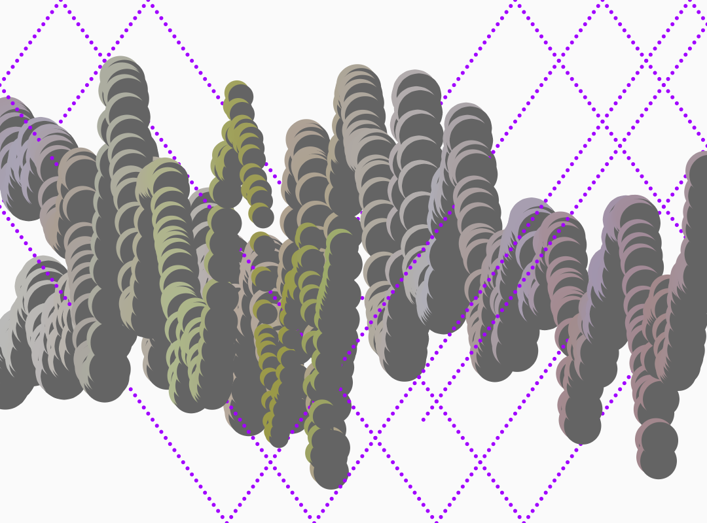
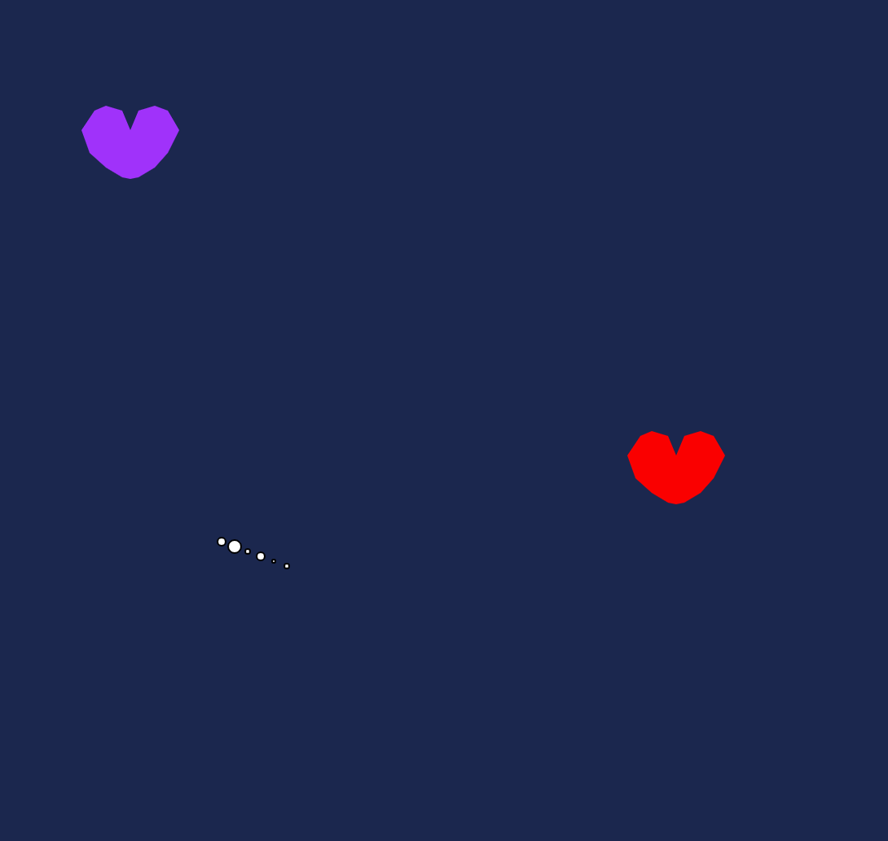
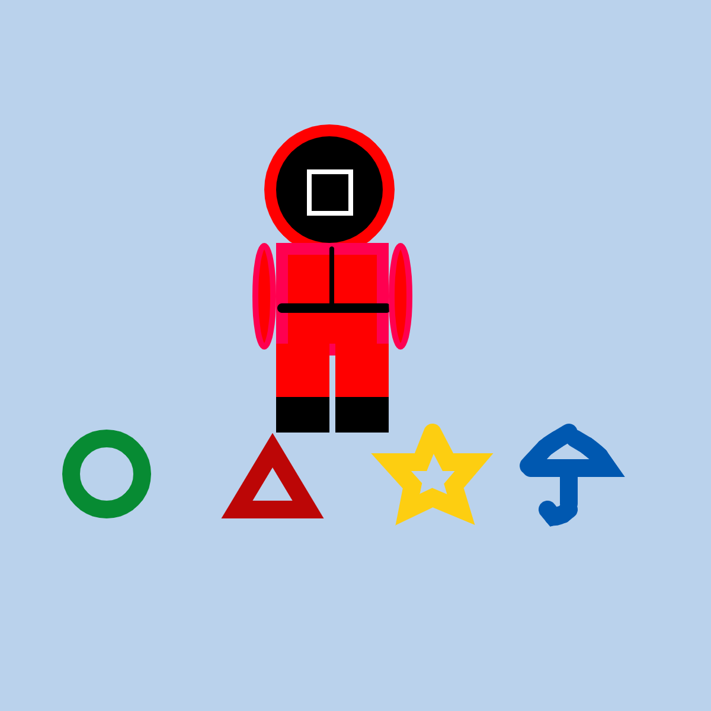
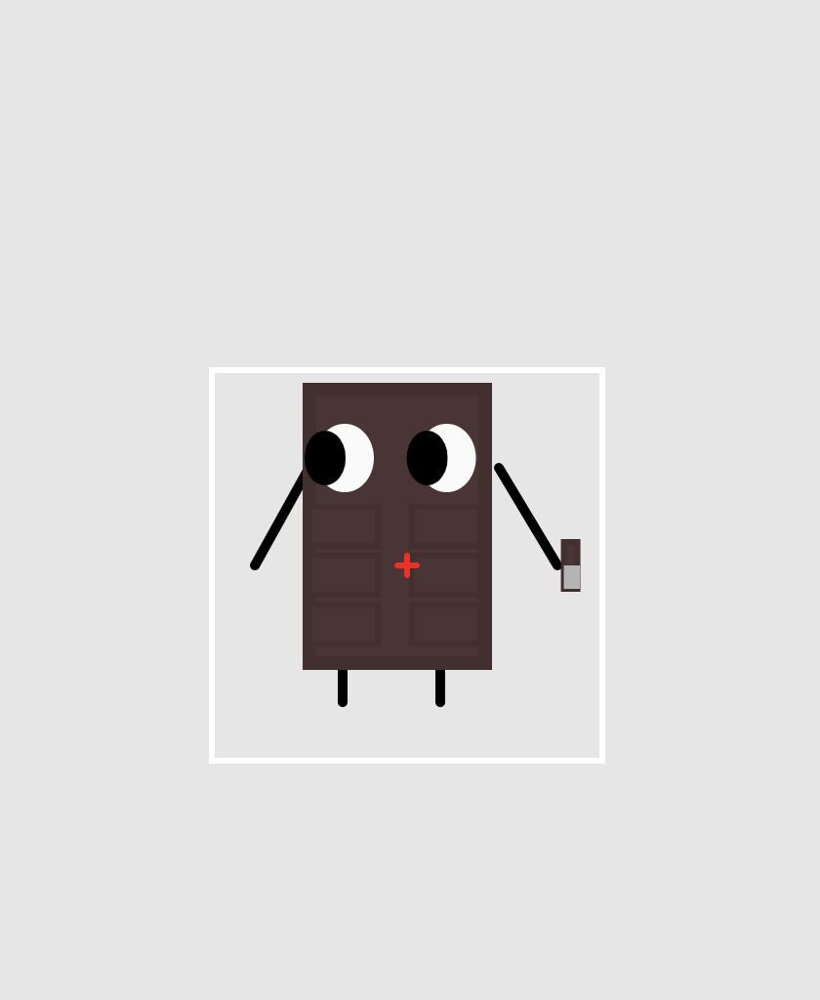
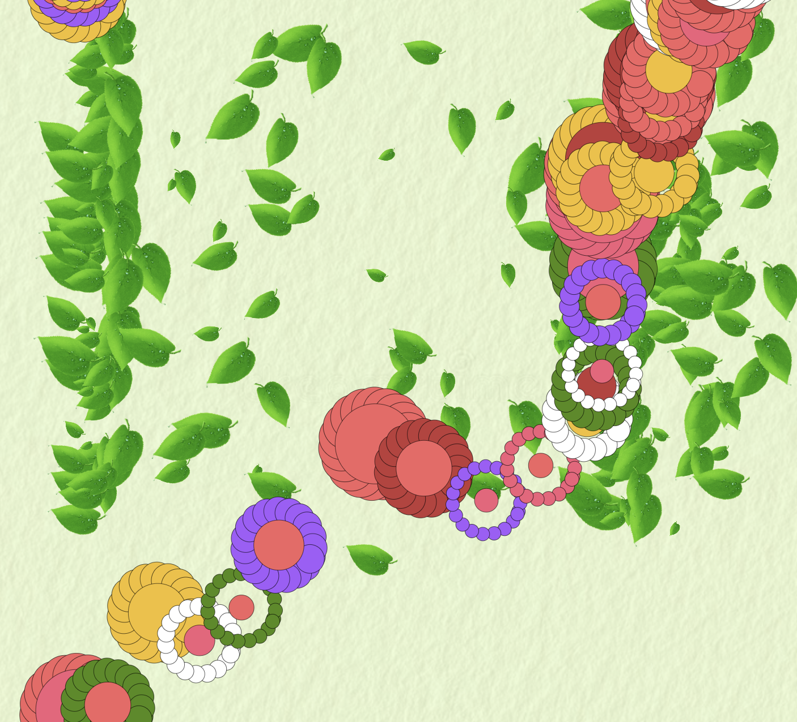

# CCLab22_Yuna
 Repository for Creative Coding Lab, Spring 2022 (IMA, NYU SH). Access it on [Creative Coding Lab](https://yuna012.github.io/Creative-Coding-Lab/).

---

[Glimpse_of_Seoul](https://yuna012.github.io/Creative-Coding-Lab/Glimpse_of_Seoul).
Project1

---

[02-yuna](https://yuna012.github.io/Creative-Coding-Lab/02-yuna).

----

[mouseIsPressed_doodling](https://yuna012.github.io/Creative-Coding-Lab/mouseIsPressed_doodling).
Project2

---
[Martixx](https://yuna012.github.io/Creative-Coding-Lab/Matrixx).
Project3

---

[Satellite](https://yuna012.github.io/Creative-Coding-Lab/Satellite).
Project4

---

[Squid_Game](https://yuna012.github.io/Creative-Coding-Lab/Squid_Game).
Project5

---

[Chocolate_after_working_out](https://yuna012.github.io/Creative-Coding-Lab/Chocolate_after_working_out).
Project6

---

[Blooming_Falling](https://yuna012.github.io/Creative-Coding-Lab/Blooming_Falling).
Project7

